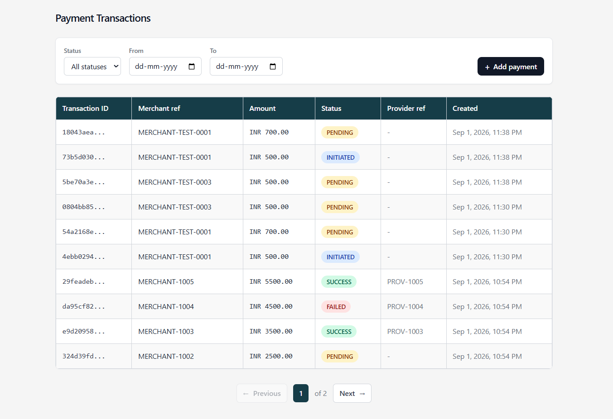

# Payment Transaction Management Application

A full-stack app for creating, tracking, and managing simulated payment
transactions — built with a focus on payment integrity, idempotency,
controlled status transitions, webhook security, audit history, and safe
database transactions.

## Table of Contents

- [Live Application](#live-application)
- [Tech Stack](#tech-stack)
- [Features](#features)
- [Project Structure](#project-structure)
- [Payment Status Flow](#payment-status-flow)
- [Payment Creation and Idempotency](#payment-creation-and-idempotency)
- [Payment Status Update](#payment-status-update)
- [Provider Webhook](#provider-webhook)
  - [HMAC Signature Verification](#hmac-signature-verification)
  - [Generate Signature Helper](#generate-signature-helper)
- [Audit Trail](#audit-trail)
- [Database Design](#database-design)
- [API Endpoints](#api-endpoints)
- [Local Setup](#local-setup)
- [Automated Tests](#automated-tests)
- [Postman Collection](#postman-collection)
- [Security and Payment Integrity](#security-and-payment-integrity)
- [Health Check](#health-check)
- [Deployment](#deployment)
- [Scaling to 20 Lakh Transactions per Day](#scaling-to-20-lakh-transactions-per-day)
- [Limitations and Design Decisions](#limitations-and-design-decisions)
- [External Services and Tools](#external-services-and-tools)
- [AI Assistance Declaration](#ai-assistance-declaration)

## Live Application

- **Frontend:** [https://payment-txn.vercel.app](https://payment-txn.vercel.app)
- **Backend API:** [https://payment-txn.onrender.com](https://payment-txn.onrender.com)
- **Health Check:** [https://payment-txn.onrender.com/api/health](https://payment-txn.onrender.com/api/health)

The frontend URL is the main entry point for accessing the application.

## Screenshots

**Transaction list with filters**


## Tech Stack

| Layer              | Tools                           |
| ------------------ | ------------------------------- |
| Frontend           | React, Vite                     |
| Backend            | Node.js, Express.js, Zod, Jest  |
| Database           | PostgreSQL, Neon                |
| Deployment / Tools | Vercel, Render, Postman, GitHub |

## Features

- Create payment transactions with backend validation
- Idempotent payment creation using the `Idempotency-Key` header
- Transaction listing with server-side filtering and pagination
- Controlled payment status transitions
- Provider webhook with HMAC-SHA256 signature verification
- Safe duplicate webhook handling
- Append-only payment status audit trail
- Automated tests for the critical payment flows

## Project Structure

```text
backend/
├── src/
│   ├── config/
│   ├── controllers/
│   ├── middleware/
│   ├── routes/
│   ├── services/
│   ├── utils/
│   ├── validators/
│   ├── app.js
│   └── server.js
├── migrations/
├── scripts/
├── tests/
└── package.json

frontend/
├── src/
├── public/
└── package.json

postman/
└── payment-transaction-api.postman_collection.json
```

Routes, controllers, services, middleware, validation, and DB config are
kept in separate layers on the backend, so the business logic stays easy
to follow as the app grows.

## Payment Status Flow

```text
INITIATED
    |
    v
 PENDING
   /   \
  v     v
SUCCESS FAILED
```

Allowed transitions:

```text
INITIATED -> PENDING
PENDING   -> SUCCESS
PENDING   -> FAILED
```

`SUCCESS` and `FAILED` are terminal. Anything outside these transitions
gets rejected by the backend with `409 Conflict`.

## Payment Creation and Idempotency

Every payment creation call needs an `Idempotency-Key` header.

```text
POST /api/payments
       |
       v
Check idempotency key
       |
       +-- Already exists + same request
       |          |
       |          +-- Return previous response
       |
       +-- Already exists + different request
       |          |
       |          +-- 409 Conflict
       |
       v
Create payment
       |
       v
Create payment history
       |
       v
Save idempotency response
       |
       v
COMMIT
       |
       v
201 Created
```

The request body gets hashed with SHA-256. Send the same idempotency key
with the same body again, and you get back the original stored response
— no duplicate payment. Reuse the key with a different body, and the API
returns `409 Conflict` instead.

## Payment Status Update

Status changes run inside a database transaction with a row-level lock.

```text
BEGIN
  |
  v
SELECT payment FOR UPDATE
  |
  v
Not found -> ROLLBACK -> 404
  |
  v
Check transition
  |
  v
Invalid -> ROLLBACK -> 409
  |
  v
UPDATE payment
  |
  v
INSERT payment history
  |
  v
COMMIT
  |
  v
200
```

The payment update and its audit-history record either both succeed or
both fail — there's no in-between state.

## Provider Webhook

A simulated payment-provider webhook is included.

```text
POST /api/webhooks/provider
            |
            v
     Verify HMAC signature
            |
            v
      BEGIN transaction
            |
            v
     Duplicate webhook?
        /          \
      YES           NO
       |             |
       v             v
     COMMIT    Update payment status
       |             |
       v             v
      200       Payment history
                     |
                     v
               Store webhook
                     |
                     v
                  COMMIT
                     |
                     v
                    200
```

Webhook payload:

```json
{
  "transactionId": "payment-uuid",
  "providerRef": "PROVIDER-123",
  "status": "SUCCESS",
  "timestamp": "2026-09-02T10:00:00.000Z"
}
```

`providerRef` in the request maps to the `provider_ref` column in
PostgreSQL.

### HMAC Signature Verification

Webhook requests are signed with HMAC-SHA256 using a shared
`WEBHOOK_SECRET`.

The signature is computed from the raw HTTP request body and passed in
the `x-webhook-signature` header. On the backend, the expected signature
is recomputed and compared using a timing-safe comparison before the
webhook is processed.

### Generate Signature Helper

For local and Postman testing:

```text
POST /api/webhooks/generate-signature
```

This generates an HMAC signature for a given webhook body, which you can
then attach as the `x-webhook-signature` header when calling
`/api/webhooks/provider`.

It's a dev/testing helper only — not a real payment-provider endpoint.

**Testing note:** while testing in Postman, an extra CRLF (`\r\n`) in the
raw request body was causing an HMAC signature mismatch. Comparing the
raw request bytes surfaced the difference, and sending the exact JSON
payload fixed it.

## Audit Trail

Every payment status change adds a row to `payment_history`, storing:

- Payment ID
- Old status
- New status
- Source (`API` or `WEBHOOK`)
- Optional note
- Timestamp

This table is treated as append-only throughout the app.

## Database Design

Four main tables:

**`payments`**
The core payment record — merchant/customer info, amount, currency,
status, provider reference, and timestamps. Protected by a UUID primary
key, a unique idempotency key, a positive-amount constraint, a status
constraint, and indexes on status and creation date.

**`idempotency_keys`**
Stores the idempotency key, the SHA-256 request hash, the response body,
the response status code, and a creation timestamp. This is what lets
retries return the original response instead of creating a new payment.

**`payment_history`**
The append-only audit trail for status changes, including old/new status
and whether the change came from the API or a webhook.

**`payment_webhooks`**
Stores incoming provider webhook events and their payloads. A unique
constraint on `(payment_id, provider_ref, status)` gives database-level
protection against duplicate webhook events.

## API Endpoints

| Method  | Endpoint                           | Purpose                                  |
| ------- | ---------------------------------- | ---------------------------------------- |
| `GET`   | `/api/health`                      | Check server and database health         |
| `POST`  | `/api/payments`                    | Create a payment                         |
| `GET`   | `/api/payments`                    | List, filter, and paginate payments      |
| `GET`   | `/api/payments/:id`                | Get a payment by ID                      |
| `PATCH` | `/api/payments/:id/status`         | Update payment status                    |
| `POST`  | `/api/webhooks/provider`           | Process a provider webhook               |
| `POST`  | `/api/webhooks/generate-signature` | Generate a webhook signature for testing |

### Create Payment Example

```http
POST /api/payments
Idempotency-Key: payment-request-001
Content-Type: application/json
```

```json
{
  "merchant_ref": "ORDER-1001",
  "customer_name": "Test Customer",
  "customer_email": "customer@example.com",
  "amount": 1500,
  "currency": "INR"
}
```

The payment is created with `INITIATED` status. The client can't set the
transaction ID, initial status, provider reference, or timestamps — the
backend controls all of that.

### Update Status Example

```http
PATCH /api/payments/:id/status
Content-Type: application/json
```

```json
{
  "status": "PENDING"
}
```

The backend checks this against the current status before allowing the
transition.

### Filtering and Pagination

```text
GET /api/payments?status=PENDING&page=1&limit=10
```

Status and date filters are both supported server-side.

## Local Setup

### 1. Clone the Repository

```bash
git clone <https://github.com/AdamDinesh/payment-txn>
cd <repository-folder>
```

### 2. Backend Setup

```bash
cd backend
npm install
```

Create a `.env` file based on `.env.example`:

```env
DATABASE_URL=
WEBHOOK_SECRET=
FRONTEND_URL=
PORT=
NODE_ENV=
```

Run migrations:

```bash
npm run db:migrate
```

Start the dev server:

```bash
npm run dev
```

Production start command:

```bash
npm start
```

### 3. Frontend Setup

```bash
cd frontend
npm install
```

Create the frontend `.env`:

```env
VITE_API_URL=
```

Start the frontend:

```bash
npm run dev
```

Build for production:

```bash
npm run build
```

### Database Scripts

```bash
npm run db:migrate
npm run db:seed
npm run db:clear
npm run db:reset
```

`db:clear` and `db:reset` are destructive — dev-only, never run these
against production. Production only ever needs:

```bash
npm run db:migrate
```

## Automated Tests

```bash
npm test
```

Three tests cover the critical payment behavior:

1. **Idempotency duplicate check** — retrying payment creation with the
   same idempotency key doesn't create a duplicate payment.
2. **Status transition conflict** — an invalid status transition gets
   rejected with `409 Conflict`.
3. **Invalid provider webhook signature** — a webhook with a bad HMAC
   signature gets rejected.

## Postman Collection

```text
postman/payment-transaction-api.postman_collection.json
```

Covers the health check, payment APIs, provider webhook, and the
webhook signature-generation helper. The real `WEBHOOK_SECRET` is not
stored in the collection.

## Security and Payment Integrity

- Strict backend request validation using Zod
- Parameterized PostgreSQL queries
- Environment-based secrets
- HMAC-SHA256 webhook verification
- Timing-safe signature comparison
- Idempotency protection
- Database transactions
- `SELECT ... FOR UPDATE` row locking
- Database uniqueness and validation constraints
- Controlled payment status transitions
- Helmet security headers
- CORS configuration
- API rate limiting
- Production-safe error responses

No real payment-provider credentials or real payment processing are
involved anywhere in this project.

## Health Check

```text
GET /api/health
```

Checks both the app server and the PostgreSQL connection.

```json
{
  "status": "ok",
  "server": "healthy",
  "database": "healthy"
}
```

The deployed backend also uses this endpoint for service health
monitoring.

## Deployment

```text
                    GitHub
                      |
              +-------+-------+
              |               |
              v               v
           Vercel           Render
          React UI        Express API
              |               |
              +-------+-------+
                      |
                      v
                 Neon PostgreSQL
```

- **Vercel** hosts the React frontend.
- **Render** hosts the Express backend.
- **Neon** hosts the PostgreSQL database.

Production database changes go through migrations only — never through
reset, clear, or seed scripts.

## Scaling to 20 Lakh Transactions per Day

The current setup works fine for testing and demo purposes, but a few
things would need to change before it can handle this kind of volume.

**1. Single backend instance can't take that much load.**
Fix: make the API stateless and run multiple instances behind a load
balancer. Nothing in the current code stores state in memory, so this
should be a straightforward change.

**2. Opening a new DB connection per request doesn't scale.**
Every new Postgres connection is expensive to open, and Postgres only
allows a limited number of connections at once. If every request opens
its own connection, we'd either waste time on connection setup or hit
that limit under load.
Fix: use connection pooling — a small set of connections stays open and
gets reused across requests, instead of opening a new one each time.
On Neon this is built in (PgBouncer) — just switch to the pooled
connection string, no setup needed. On plain/self-hosted Postgres,
you'd run PgBouncer yourself in front of the database to get the same
effect.

**3. `payment_history` and `payment_webhooks` will keep growing and slow down queries over time.**
Fix: add proper indexes on the columns we filter by (status,
created_at), and partition these tables by time once they get large.
Older records that are rarely queried can be archived off to cheaper
storage instead of sitting in the primary database forever.
`idempotency_keys` grows at the same rate — one row per payment request
— and needs the same treatment. It's easy to forget since it's not the
"main" table people think about first.

**4. Webhook processing blocking the response.**
Fix: acknowledge the webhook fast, then push any slower work (retries,
notifications, etc.) to a background queue (SQS/RabbitMQ/Kafka) and
have separate worker processes consume from it and handle retries,
instead of doing everything inline in the request. Keep it idempotent
so retries are safe.

**5. Rate limiting / caching won't work correctly once there's more than one instance running.**
Fix: move that to Redis so all instances share the same state.

Things worth monitoring once this is live: API response times, error
rates, queue depth, DB connections, slow queries, and webhook failures.

## Limitations and Design Decisions

- The payment provider is simulated — no real payment gateway is
  integrated.
- Status transitions are intentionally strict, to protect transaction
  integrity.
- The signature-generation endpoint exists purely to make webhook
  testing in Postman easier.
- CSV reconciliation isn't included — it's an optional bonus feature
  that didn't make the cut this round.

## External Services and Tools

- **Neon** — hosted PostgreSQL database
- **Render** — backend hosting
- **Vercel** — frontend hosting
- **Postman** — API and webhook testing
- **GitHub** — source control and repository hosting

No external third-party payment API is integrated — provider behavior is
simulated through the webhook endpoint.

## AI Assistance Declaration

AI tools were used during development for things like clarifying
requirements, talking through implementation approaches, debugging, and
documentation support.

The implementation itself was written, reviewed, and tested by me. I
understand each of the flows and design decisions in this project —
idempotency, database transactions, row locking, status transitions,
audit history, duplicate webhook handling, and HMAC signature
verification — and can walk through any of them in detail.
